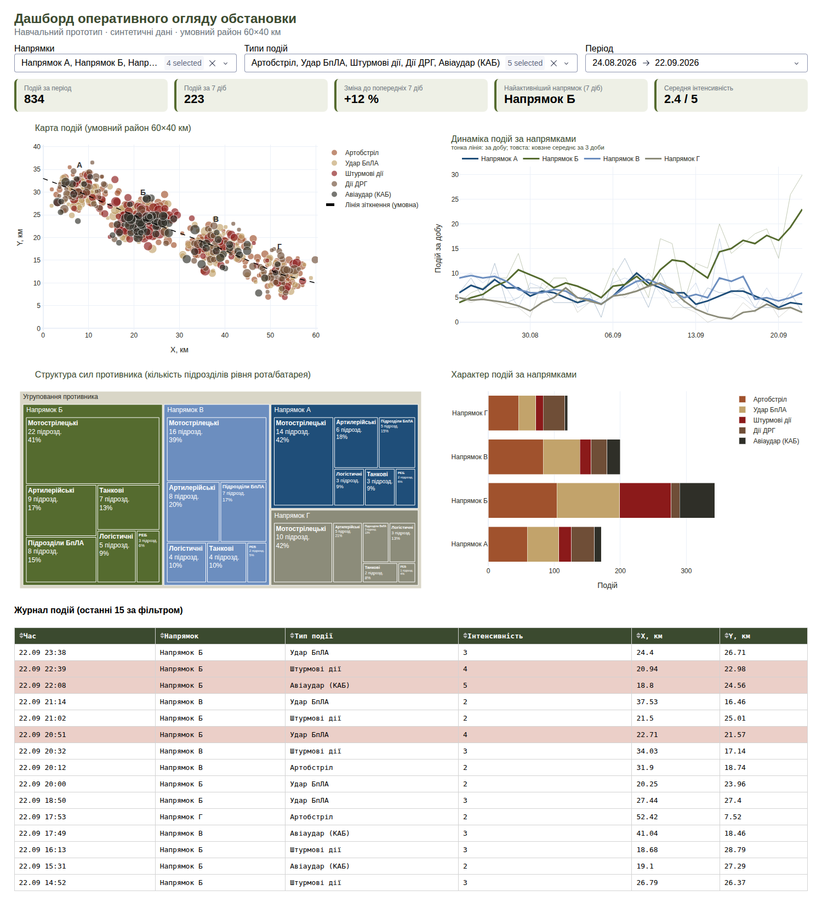

# Практична робота 5.3. Варіант 7: дашборд оперативного огляду обстановки

Прототип дашборда, що об'єднує KPI, карту подій, часовий ряд, структуру сил противника, характер подій та журнал подій на одній сторінці, з мінімальною взаємодією (фільтри).



## Файли
| Файл | Що це |
|---|---|
| `5.3task.ipynb` | основний звіт: підготовка даних, вибір візуалізацій, побудова елементів, аналітичні висновки |
| `app.py` | інтерактивний дашборд (Python Dash): фільтри напрямків, типів подій і періоду |
| `dashboard.html` | статична версія, відкривається у браузері (потрібен інтернет для завантаження Plotly) |
| `figures.py` | спільний модуль побудови графіків |
| `data/events.csv` | синтетичний журнал подій (837 записів, з навмисними дублікатами й пропусками для очищення) |
| `data/forces.csv` | синтетична оцінка складу сил противника |

## Запуск інтерактивного дашборда
```bash
pip install dash plotly pandas numpy
python app.py
```
Після запуску відкрити http://127.0.0.1:8050.

## Основні висновки
- Напрямок Б — головне зусилля противника: +60 % подій за тиждень, 38 % штурмових дій і КАБ, 36 % виявлених підрозділів.
- Напрямок Г затихає (−31 %), можливе перекидання засобів на Б.

Оформлення: палітра військового стилю (NATO blue, олива, земляні тони; штурмові дії противника виділено темно-червоним). У ноутбуці є відповіді на контрольні запитання для самоперевірки (розділ 5).

Усі дані синтетичні, район і координати умовні.
