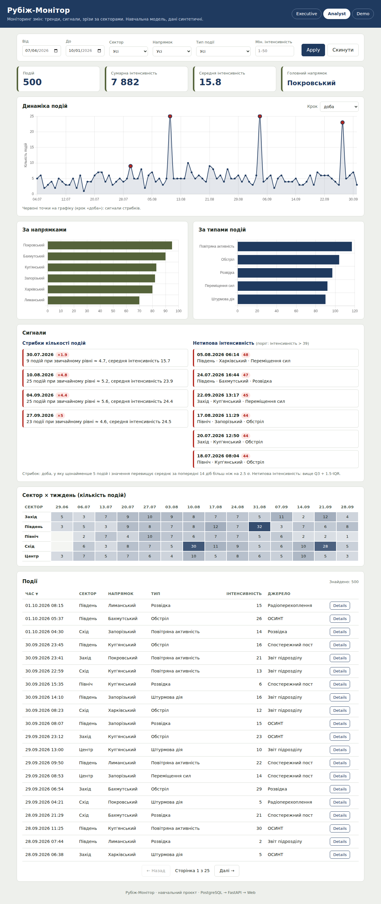

# Практична робота 5.8. Варіант 7: міні ІАС «Рубіж-Монітор»

Міні інформаційно-аналітична система моніторингу змін. Акцент на трендах і «сигналах»
(стрибки кількості подій, нетипова інтенсивність), швидких зрізах за секторами й типами та таблиці подій
для перевірки першоджерел.

```
PostgreSQL  →  FastAPI (sync, raw SQL, psycopg2)  →  Web (HTML/CSS/JS + Chart.js)
```

Без Docker, без async, без ORM. Усі дані синтетичні, сектори й напрямки умовні.



## Структура

| Папка / файл | Призначення |
|---|---|
| `db/schema.sql` | схема: таблиця `incidents` і 4 індекси |
| `db/seed.py` | 500 синтетичних подій за 90 діб, зі «сплесками» й нетиповими значеннями |
| `api/db.py` | `get_conn()`: з'єднання psycopg2 з autocommit, без пулів |
| `api/main.py` | усі ендпоїнти (синхронні, сирий SQL, параметризовані запити) |
| `web/` | `index.html`, `app.js`, `styles.css`: дашборд на одній сторінці |
| `scripts/` | `init_db`, `seed_db`, `smoke_test` для Linux (`.sh`) і Windows (`.ps1`) |
| `docs/` | скріншоти режимів і опис архітектури |

## Запуск за 3 хвилини

Потрібні: Python 3.10+, PostgreSQL з клієнтом `psql`.

### Linux / macOS

```bash
python3 -m venv .venv && source .venv/bin/activate
pip install -r requirements.txt
cp .env.example .env            # впишіть USER і PASSWORD у DATABASE_URL

psql -U postgres -c "CREATE DATABASE rubizh_monitor;"
bash scripts/init_db.sh         # схема
bash scripts/seed_db.sh         # 500 тестових записів

uvicorn api.main:app --reload   # API на http://localhost:8000
```

У другому терміналі:

```bash
cd web && python3 -m http.server 5500
```

Відкрити http://localhost:5500.

### Windows (PowerShell)

```powershell
python -m venv .venv; .\.venv\Scripts\Activate.ps1
pip install -r requirements.txt
Copy-Item .env.example .env     # впишіть USER і PASSWORD у DATABASE_URL

psql -U postgres -c "CREATE DATABASE rubizh_monitor;"
.\scripts\init_db.ps1
.\scripts\seed_db.ps1

uvicorn api.main:app --reload
```

У другому вікні:

```powershell
cd web; python -m http.server 5500
```

Якщо PowerShell не дозволяє запускати скрипти: `Set-ExecutionPolicy -Scope Process Bypass`.

### Перевірка

```bash
bash scripts/smoke_test.sh        # Linux/macOS
.\scripts\smoke_test.ps1          # Windows
```

Скрипт звертається до `/health`, `/filters`, `/kpi`, `/trend` і виводить `OK`, якщо відповіді мають очікувані ключі.
Адресу API можна змінити: `API_BASE_URL=http://host:8000`.

> Сторінку потрібно відкривати через `http://localhost:5500`, а не подвійним кліком (`file://`).
> Для графіків потрібен інтернет: Chart.js підключається через CDN.

## Режими для різних аудиторій (`?view=`)

| Режим | Що показано | Що приховано |
|---|---|---|
| `executive` | KPI, тренд, короткий текстовий висновок | розподіли, сигнали, heatmap, таблиця |
| `analyst` (за замовчуванням) | усе | нічого |
| `demo` | KPI, тренд, розподіли, сигнали, heatmap | таблиця подій; поле `source` приховано всюди |

Після кожної зміни фільтрів (кнопка **Apply**) оновлюються всі видимі блоки одночасно.

## Сценарій демонстрації (≈ 3 хв)

1. Відкрити `?view=executive`: прочитати KPI та висновок, звернути увагу на попередження про стрибок за останні 7 діб.
2. Перейти в `?view=analyst`: на графіку знайти червоні точки (стрибки) і порівняти їх з блоком «Сигнали».
3. Вибрати сектор «Схід», мінімальну інтенсивність 20 і натиснути **Apply**: усі блоки перерахувалися.
4. У таблиці відсортувати за інтенсивністю й відкрити **Details** для найсильнішої події.
5. Змінити крок графіка з «доба» на «тиждень».
6. Перейти в `?view=demo`: таблиці й джерела немає, лишилися KPI, графіки та heatmap.

## API

Усі аналітичні ендпоїнти приймають необов'язкові фільтри:
`from`, `to` (`YYYY-MM-DD`, `to` включно), `sector`, `direction`, `event_type`, `min_intensity` (1–50).

| Ендпоїнт | Відповідь |
|---|---|
| `GET /health` | `{ "status": "ok" }` |
| `GET /filters` | `sectors`, `directions`, `event_types`, `min_date`, `max_date` |
| `GET /kpi` | `total_incidents`, `total_intensity`, `avg_intensity`, `top_direction` |
| `GET /trend?group=day\|week` | `[{ t, value }]`, пропущені доби/тижні доповнено нулями |
| `GET /distribution/directions` | `[{ label, value }]` |
| `GET /distribution/types` | `[{ label, value }]` |
| `GET /heatmap` | `{ columns: [тижні], rows: [{ sector, values }] }` |
| `GET /incidents?page&page_size&sort&order` | `{ total, page, page_size, items }`; `page_size` 5–100 |
| `GET /incidents/{id}` | повний запис, 404 якщо немає |
| `GET /signals` | **додатково для варіанту 7**: `spikes`, `outliers`, `rules` |

Інтерактивна документація: http://localhost:8000/docs.

Безпека запитів: значення фільтрів передаються лише як параметри SQL, поле сортування перевіряється за білим списком,
помилкові дати повертають 400.

## Як працюють «сигнали» (специфіка «Рубіж-Монітор»)

- **Стрибок.** Для кожної доби береться кількість подій і порівнюється з попередніми 14 добами:
  сигнал, якщо подій ≥ 5 і значення перевищує середнє більш ніж на 2,5 стандартного відхилення.
  Потрібно щонайменше 7 діб історії.
- **Нетипова інтенсивність.** Подія з інтенсивністю вище `Q3 + 1,5·IQR` (міжквартильний розмах за вибраним фільтром).
- Правила рахуються на вибірці після застосування фільтрів, тому сигнали змінюються разом із зрізом.
- У тестових даних навмисно закладено 3 сплески (по 20 подій за добу в одному секторі) і 6 подій з інтенсивністю 44–50.

## Обмеження

- Модель навчальна: дані синтетичні, жодних реальних подій і координат.
- Джерело даних одне (таблиця `incidents`), оновлення в реальному часі немає.
- `seed.py` очищує таблицю `incidents` перед заповненням; для відтворюваної вибірки: `python db/seed.py --seed 42`.
