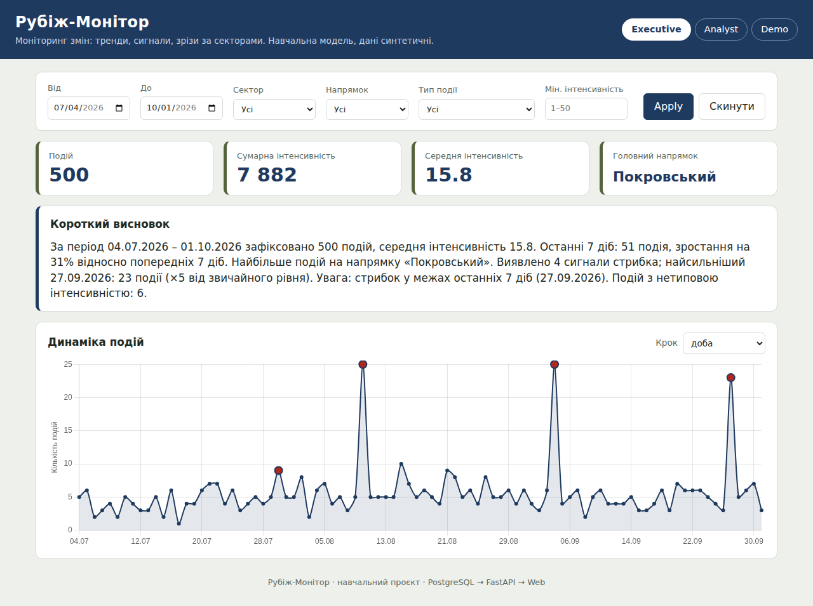
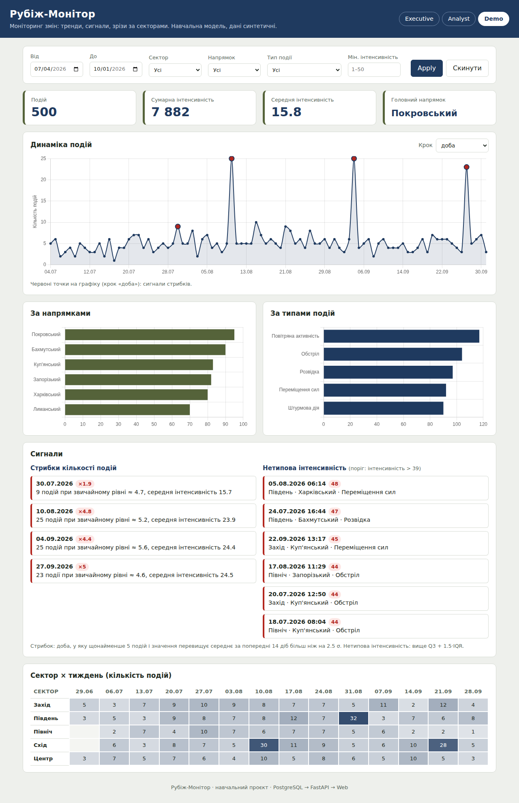

# Архітектура «Рубіж-Монітор»

```
┌──────────────┐   SQL (psycopg2)   ┌────────────────────┐   JSON / HTTP    ┌─────────────────────┐
│  PostgreSQL  │ ◄───────────────── │  FastAPI (sync)    │ ◄─────────────── │  Web: index.html    │
│  incidents   │                    │  api/main.py       │   fetch()        │  app.js + Chart.js  │
└──────────────┘                    └────────────────────┘                  └─────────────────────┘
   db/schema.sql                       http://localhost:8010                   http://localhost:5500
   db/seed.py
```

## Потік даних

1. `db/seed.py` створює 500 синтетичних записів у таблиці `incidents`.
2. `api/main.py` приймає запит із фільтрами, будує `WHERE` з параметрами та виконує SQL.
3. `web/app.js` збирає фільтри з форми, паралельно викликає потрібні ендпоїнти
   та оновлює лише ті блоки, що видимі в поточному режимі (`?view=`).

## Таблиця `incidents`

| Поле | Тип | Примітка |
|---|---|---|
| `id` | SERIAL PK | |
| `occurred_at` | TIMESTAMP NOT NULL | індекс |
| `sector` | TEXT NOT NULL | індекс |
| `direction` | TEXT NOT NULL | індекс |
| `event_type` | TEXT NOT NULL | індекс |
| `intensity` | INT NOT NULL | `CHECK (1..50)` |
| `source` | TEXT | у режимі `demo` не показується |
| `summary` | TEXT | |

## Режими аудиторій

| Режим | Блоки |
|---|---|
| `executive` | KPI, тренд, текстовий висновок |
| `analyst` | KPI, тренд, розподіли, сигнали, heatmap, таблиця подій |
| `demo` | KPI, тренд, розподіли, сигнали, heatmap (без таблиці й без `source`) |

## Скріншоти

| executive | demo |
|---|---|
|  |  |

Режим `analyst` показано в [README](../README.md); модальне вікно подробиць: [dashboard_modal.png](dashboard_modal.png).
